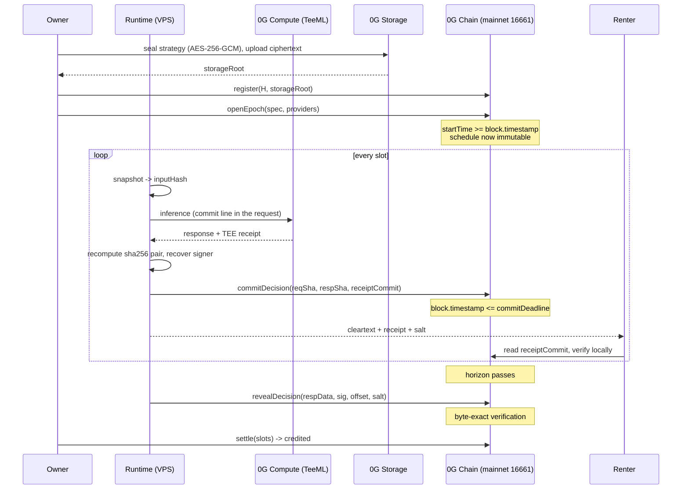

# Architecture

Fief sells private trading signals whose complete forward record becomes
publicly verifiable after the edge expires. Two properties carry the product,
and everything below exists to serve one of them:

1. **Prospective completeness.** The schedule is fixed on-chain before any
   outcome is knowable, and every scheduled slot is publicly accounted for.
2. **Private now, provable later.** The renter gets the signal while it is worth
   money; the world gets the proof once it is not.

## The loop



The renter's read in that loop is the point. They verify the payload against a
commitment the chain already holds, so they never have to trust the feed, and
they can do it before the reveal exists.

## Contracts (0G mainnet 16661)

| contract | address | job |
|---|---|---|
| `EpochBook` | `0x9f02bfBbc52fD91d1899C298B71AF1871CA45DF8` | the schedule, fixed before outcomes exist |
| `RecordBook` | `0x40eB003340f467e096F8Ae30f8696bE40Eba922c` | commit/reveal and byte-exact verification |
| `FiefAgent` | `0x4db74faF047160893Aa0dabC9A1B8F3297570a68` | ownership, operator, strategy commitment |
| `RentalDesk` | `0x75C6ce6c6Cc40c922B30F985e75580C32Cd78e57` | listings, escrow, epoch-bound grants |
| `TeemlReceiptVerifier` | library | reusable 0G TeeML receipt verification |

### Why the schedule is a contract and not a config

`EpochBook.openEpoch` rejects any `startTime` earlier than `block.timestamp`.
That single check is why the record is prospective: without it an operator could
open an epoch over a window whose outcomes are already resolved and "commit" to
the past.

`missed` is derived, never stored. A slot with no commitment past its deadline
*is* missed, computable by any reader for zero gas, which keeps a 144-slot day
at O(1) storage while still accounting for every slot. `finalizeEpoch` asserts
`committed + missed == slotCount` on-chain rather than merely documenting it.

### What the reveal actually checks

```
keccak256(abi.encode(respData, sig, offset, inputHash, renter, salt)) == receiptCommit
sha256(respData)                                                      == committed respSha
ecrecover(EIP-191("<reqSha>:<respSha>"), sig)                         == getService(provider).teeSignerAddress
respData[offset .. offset+len(EXP)]                                   == EXP
```

`EXP` is rebuilt from on-chain state plus two caller arguments, so it cannot be
forged into a TEE-signed response. `commitOffset` is untrusted input; the memcmp
is the entire security property.

This is **strictly stronger than 0G's own client SDK**. `processResponse` in
`0g-compute-ts-sdk` trusts the provider-returned `text` and only ecrecovers it,
so a provider signing over bytes it did not serve passes there. Here the text is
rebuilt from the real request and response hashes before recovery.

## Off-chain

| component | what it is |
|---|---|
| `packages/reference` | executable spec, zero chain deps. The Foundry suite imports its fixtures |
| `runtime` | slot scheduler, decision loop, renter feed, reveal job, settlement |
| `web` | Next.js on Cloudflare Pages, completeness bar and slot timeline |
| `contracts` | Foundry, Solidity 0.8.28 |

The reference model exists so that Solidity and TypeScript cannot drift. It uses
only `@noble/hashes` and `@noble/curves`, deliberately no ethers or viem, so it
can never inherit behaviour from a client library. `web` imports it as a
devDependency and a parity test asserts the commit-line bytes match, which is
what stops the UI describing a line the chain would reject.

## 0G components, and what each one is load-bearing for

| component | role | network |
|---|---|---|
| **0G Chain** | timestamps the schedule, the sealed commits, the verified reveals, the money | mainnet 16661 |
| **0G Compute (TeeML)** | produces the attributable inference; its enclave key is recovered on-chain | mainnet |
| **0G Storage** | holds the AES-256-GCM sealed strategy; its merkle root is the agent's `storageRoot` | mainnet |
| **Agentic ID + ERC-8004** | identity and renter reputation, gated on a serve proof | **testnet 16602** |

The last row is testnet because the Agentic ID SDK states no mainnet deployment
exists. Every surface showing that data says testnet.

## Honest limits

- **The commitment is declared on the response side.** The request holds the
  secret strategy, so only its hash is public. A dishonest owner could run a
  request that does not contain strategy `H` yet instructs the model to echo
  `H`. Closed by an authorized request audit today, and by a ZK prefix opening
  later.
- **Completeness is per-epoch.** An author can abandon a bad epoch and open a
  fresh one. Every epoch ever opened is listed, including abandoned ones, so
  epoch-shopping is visible rather than impossible.
- **The record proves provenance, timing and completeness. Never alpha.** P&L is
  shown as context and labelled unverified.
- **A renter observing many decisions can approximate the strategy.** Mitigated
  by rate limits and the disclosure delay, documented rather than denied.

## Threats the design actually closes

| threat | what stops it |
|---|---|
| publish only the winners | schedule fixed before outcomes; every slot accounted for |
| wait for the outcome, then commit | `block.timestamp <= commitDeadline`, on-chain |
| open an epoch over a resolved window | `startTime >= block.timestamp`, on-chain |
| sit on a losing call and never reveal | reveal is permissionless; the renter holds the payload |
| grief an honest agent with bad reveals | a failed reveal changes nothing; `invalid` is derived at finalize |
| replay a genuine receipt into another slot | commit line names book, chain, agent, epoch and slot |
| block settlement by refusing payment | pull payments; a hostile payee breaks only their own withdrawal |
| rate an agent you never used | ERC-8004 `giveFeedback` requires a serve proof bound to you |
